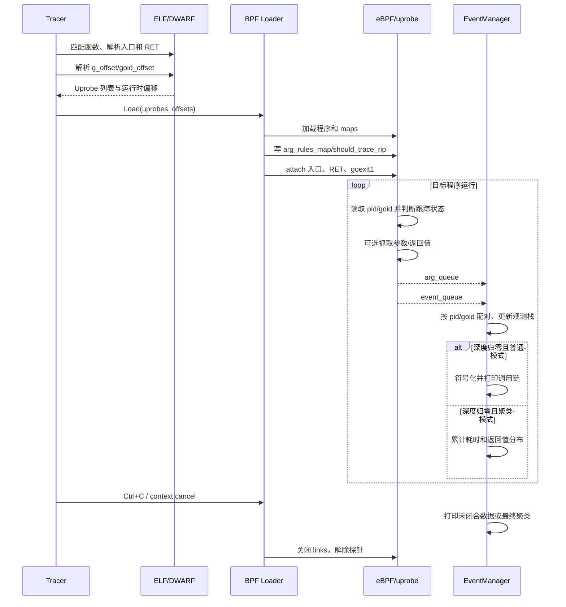

# go-ftrace 设计与实现

> 本文面向 go-ftrace 的使用者和贡献者，说明项目的设计目标、关键取舍、完整执行流程与当前实现边界。
>
> 项目早期的设计背景和基础原理可参考：[观测 Go 函数调用：go-ftrace 设计实现](https://www.hitzhangjie.pro/blog/2023-12-12-%E8%A7%82%E6%B5%8Bgo%E5%87%BD%E6%95%B0%E8%B0%83%E7%94%A8go-ftrace%E8%AE%BE%E8%AE%A1%E5%AE%9E%E7%8E%B0/)。本文以仓库当前代码为准，补充了自动参数推导、多进程隔离、goroutine 退出回收和聚类输出等后续演进。

## 1. 项目定位

go-ftrace 是一个面向 Go ELF 可执行文件的无侵入函数调用观测工具。它不要求修改业务源码，也不需要重新编译插桩，而是：

1. 在用户态解析目标二进制的 ELF、符号表、DWARF 和机器指令；
2. 找到待观测函数的入口以及所有 `RET` 指令；
3. 使用 eBPF `uprobe` 在这些位置采集函数进入、返回、参数和时间戳；
4. 按进程和 goroutine 重建已观测函数的嵌套关系；
5. 输出调用位置、源码位置、耗时、参数与返回值，或生成聚合统计。

需要先明确三个边界：

- 项目名中的 “ftrace” 表示它提供类似 function graph tracer 的体验，当前实现并未接入 Linux tracefs/ftrace 子系统；底层使用的是 `bpf(2)`、eBPF 和 uprobe。
- 输出的“调用链”只包含已经挂载 uprobe 的函数。未被 `-u` 或参数规则选中的函数不会产生事件，因此不会出现在调用链中。
- 当前返回点没有使用 `link.Uretprobe`，而是反汇编函数体，并在每一条 `RET` 指令上挂普通 uprobe。

## 2. 设计目标与取舍

### 2.1 设计目标

- **无侵入**：不修改目标进程，不依赖业务代码埋点。
- **按 goroutine 组织事件**：Go 调度器会让 goroutine 在线程间迁移，调用关系不能只按线程 ID 归组。
- **可观测函数图**：同时采集入口和返回事件，在用户态还原嵌套关系并计算耗时。
- **参数可解释**：支持显式寻址规则，也能从 DWARF 类型信息和 Go 寄存器 ABI 自动生成常见类型的抓取规则。
- **控制高频输出**：除逐条打印外，支持按函数聚合延迟和返回值分布。
- **支持同一二进制的多个进程实例**：所有 goroutine 状态均以 PID 隔离，避免不同进程中相同 goid 串扰。

### 2.2 关键取舍

#### 用户态做复杂解析，内核态只做有界采集

ELF/DWARF 解析、指令反汇编、规则生成、符号化和格式化都放在用户态；eBPF 程序只完成状态判断、寄存器/内存读取以及向固定容量队列写入。这样既满足 verifier 对程序复杂度的限制，也使展示逻辑更容易扩展。

#### 以 goroutine 为跟踪状态，而不是逐函数独立过滤

`should_trace_rip` 只决定“哪个函数可以启动一次 goroutine 跟踪”。goroutine 命中触发函数后，会进入 `should_trace_goid`，随后它执行到的所有已挂载函数都会被记录，直至 `runtime.goexit1` 清理该状态。

这可以保留触发函数之后的已挂载调用链，但也意味着跟踪状态不是在触发函数返回时结束。一个长生命周期 goroutine 一旦被触发，之后执行到的其他已挂载函数仍会被采集。

#### 返回点使用每条 `RET` 上的普通 uprobe

Go 函数可能有多个返回出口。当前实现通过 x86-64 反汇编找出全部 `RET`，逐点挂载同一个返回处理程序。这让返回点地址可以直接作为返回值抓取规则的 key，也避免把实现依赖在 `uretprobe` 的返回关联机制上。

## 3. 总体架构


代码按职责分为：

| 目录 | 职责 |
| --- | --- |
| `cmd/` | 命令行、资源限制、启动流程、信号处理 |
| `elf/` | ELF/DWARF 读取、符号解析、PC/文件偏移转换、反汇编、Go runtime 偏移解析 |
| `internal/uprobe/` | 函数匹配、探针描述、手动规则解析、自动规则推导 |
| `internal/bpf/` | eBPF C 程序、bpf2go 产物、map 初始化、uprobe 挂载和队列轮询 |
| `internal/eventmanager/` | 参数配对、按 PID/goid 维护状态、调用栈闭合、逐条打印和聚类统计 |

## 4. 从命令行到探针列表

### 4.1 CLI 配置

入口为 `cmd/ftrace/main.go`，Cobra 命令定义在 `cmd/root.go`。与设计直接相关的参数如下：

| 参数 | 含义 |
| --- | --- |
| `-u, --uprobe-wildcards` | 必填；选择需要挂载探针的函数，支持多次指定和通配符 |
| `-x, --exclude-vendor` | 默认开启；排除名字中含 `/vendor/` 的函数 |
| `-f, --fargs` | 显式指定函数入口参数抓取规则 |
| `-r, --frets` | 显式指定函数返回值抓取规则 |
| `-A, --fargs-auto` | 默认开启；自动推导入口参数规则 |
| `-R, --frets-auto` | 默认开启；自动推导返回值规则 |
| `-D, --drilldown` | 仅打印根函数名与指定值相同的闭合调用栈 |
| `-P, --trimprefix` | 去掉输出源码路径的公共前缀 |
| `-c, --cluster` | 不逐条打印，改为聚合函数耗时和返回值 |
| `--cluster-interval` | 聚合结果的周期输出间隔，默认 `5s`；设为 0 时只在退出时输出 |

显式出现 `--fargs` 时，入口参数的自动推导会整体关闭；显式出现 `--frets` 时，返回值自动推导会整体关闭。两类开关相互独立。

### 4.2 `attach` 与 `wanted` 是两个不同概念

这是理解当前实现最重要的区分。

- **attach 集合**：真正挂载入口和返回探针的函数集合。
- **wanted 集合**：可以把 goroutine 置为“正在跟踪”状态的触发函数集合。

`internal/uprobe/parser.go` 的规则是：

```text
attach = 匹配 (-u 模式 ∪ --fargs/--frets 中的函数名) 的全部函数

如果没有 --fargs/--frets 函数名：
    wanted = attach
否则：
    wanted = attach 中匹配 --fargs/--frets 函数名的函数
```

例如：

```bash
ftrace -u 'main.*' ./app \
  --fargs 'main.Handle(req=(%ax):u64)'
```

此时 `main.*` 中可解析的函数都会 attach，但只有 `main.Handle` 是 wanted 触发点。`main.Handle` 命中后，同一 goroutine 后续执行到的其他已挂载 `main.*` 函数才会被记录。

`-u` 当前仍是必填项，即使 `--fargs` 或 `--frets` 已经给出了函数名也不能省略。

### 4.3 符号匹配

`uprobe.Parse` 遍历 ELF `.symtab`：

1. 只保留 `STT_FUNC`；
2. 使用项目的 wildcard 规则匹配函数名；
3. 按配置排除 `/vendor/`；
4. 形成去生成探针的函数列表。

因此目标文件必须保留 `.symtab`。被完全内联且没有独立函数符号/函数体的代码无法按普通函数挂载。

## 5. ELF、DWARF 与探针地址

uprobe 注册需要的是指令相对 ELF 文件开头的偏移，而不是进程虚拟地址。对于 `.text` 中的符号：

\[
\text{fileOffset} = \text{symbol.Value} - \text{textSection.Addr} + \text{textSection.Offset}
\]

`elf.FuncOffset` 实现了这项转换。

### 5.1 函数入口

入口探针描述同时保存：

- `Address`：函数入口虚拟地址，用于 `should_trace_rip` 和入口参数规则；
- `AbsOffset`：入口相对 ELF 文件开头的偏移，用于注册 uprobe；
- `RelOffset = 0`：用于用户态反查探针。

### 5.2 函数返回点

`elf.FuncRawInstructions` 优先用 DWARF 的 `lowpc/highpc` 确定函数范围，失败时回退到符号表推断；`elf.FuncRetOffsets` 使用 `x86asm.Decode` 反汇编并收集全部 `RET`。

每个返回点保存：

- `AbsOffset`：`RET` 相对 ELF 文件开头的偏移；
- `RelOffset`：`RET` 相对函数入口的偏移；
- `Address`：`RET` 的虚拟地址，用于返回值抓取规则。

如果函数体中没有解析到 `RET`，当前实现会跳过该函数的入口和返回探针。常见原因包括无返回函数、尾调用或无法可靠确定/解码函数范围。

### 5.3 为什么保留虚拟地址和文件偏移两套值

两者用途不同：

- `link.UprobeOptions.Offset` 需要文件偏移；
- uprobe 触发时 `ctx->ip` 是虚拟地址；
- eBPF map 以触发时可直接取得的虚拟地址作为 key；
- 用户态通过虚拟地址反查符号、函数内偏移和源码行号。

当前仅支持非 PIE 二进制，因此静态虚拟地址可以直接与运行时 IP 对应，不需要额外处理加载基址重定位。

## 6. 参数与返回值抓取

### 6.1 手动规则

手动规则采用如下形式：

```text
functionName(name=(address-expression):type, ...)
```

例如：

```text
main.(*Student).String(
    s.name=(*+0(%ax)):c64,
    s.name.len=(+8(%ax)):s64,
    s.age=(+16(%ax)):s64
)
```

规则从一个寄存器开始，再执行最多若干步偏移或解引用：

- `(%ax)`：直接读取寄存器 AX；
- `(+16(%ax))`：读取地址 `AX + 16` 处的数据；
- `(*+0(%ax))`：先从 `AX + 0` 读取一个指针，再从该指针指向的地址取值。

支持的输出类型为：

- `s8/s16/s32/s64`：有符号整数；
- `u8/u16/u32/u64`：无符号整数；
- `c8/c16/c32/c64/c128/c256/c512`：固定字节数的字符数据。

规则还有两个容易忽略的实现约束：内存偏移写入 BPF 结构时使用 `int16`，应限制在 `[-32768, 32767]`；寄存器读取路径一次只复制 8 字节，因此 `c128/c256/c512` 必须使用内存寻址，不能用 `(%reg)` 直接读取完整值。

完整语法见 [`FetchArgRule.zh_CN.md`](./FetchArgRule.zh_CN.md) 和 [`FetchArgExamples.zh_CN.md`](./FetchArgExamples.zh_CN.md)。

### 6.2 自动规则

自动推导分成两步：

1. `elf.FunctionVariables` 从目标函数 DWARF DIE 的直接子节点中读取形参和返回值类型；返回值通过 `DW_AT_variable_parameter` 或 Go 的 `~rN` 命名识别。
2. `internal/uprobe/auto.go` 按 Go amd64 寄存器 ABI 的整数寄存器顺序，把类型树展开到 `ax, bx, cx, di, si, r8, r9, r10, r11`。

这里没有求值 DWARF location expression，而是假定目标函数使用当前实现所支持的 Go amd64 寄存器 ABI，并根据声明顺序和类型结构推算位置。这种简化不覆盖 ABI0、栈传参/栈返回、浮点/复数寄存器，以及寄存器容量不足时整体回退到栈的情形；对这些函数应关闭自动推导并编写经过验证的手动规则。

当前自动展开规则包括：

| Go 类型 | 抓取方式 |
| --- | --- |
| 整数、布尔、枚举、普通指针 | 一个整数寄存器标量 |
| `string` | `.data` 固定读取数据区前 8 字节，`.len` 单独输出；不会按长度重建完整字符串 |
| slice | `.data/.len/.cap` 三个 word |
| interface | `.itab/.data` 两个 word |
| struct | 按字段递归展开 |
| `*struct` | 读取指针 word，解引用后按字段偏移展开 |

对于可能为 nil 的 `*struct`，自动规则会设置 `nil_check`。内核发现基址寄存器为 0 时不再解引用，用户态把同一对象的多个扁平字段合并显示为 `ret0=nil` 之类的结果。

自动推导还有两项针对 Go DWARF 的修正：

- 只读取目标函数 DIE 的直接子节点，避免把词法块或内联子程序的参数误认为当前函数参数；
- 对同名返回值去重，兼容含 `defer` 的函数可能生成重复 `~rN` DIE 的情况。

### 6.3 规则在 BPF map 中的表示

每个 probe point 对应一组 `arg_rules`，写入 `arg_rules_map`：

- 入口参数以函数入口虚拟地址为 key；
- 返回值以每条 `RET` 的虚拟地址为 key；
- BPF 结构最多容纳 8 个叶子值；
- 每个值的 Go 侧 `Rules` 最多为 8 条，其中第一条是基址寄存器，因此后续最多 7 步偏移/解引用；
- 单个抓取结果最多保存 64 字节。

手动规则超过上限时会在加载阶段报错。自动展开通常在达到 8 个叶子时停止，但当前实现对一次展开出多个叶子的复合类型（如 string/slice/interface）没有预留容量：接近上限时可能生成超过 8 条规则并导致加载失败，而不是自动截断。

当前规则在 BPF 程序加载阶段一次性写入。map 本身是 HASH，但 CLI 尚未提供运行过程中动态增删规则的控制面。

### 6.4 内核态取值

`fetch_args` 根据规则分两类执行：

- `ARG_RULE_REG`：从 `pt_regs` 直接读取指定寄存器；
- `ARG_RULE_MEMORY`：以寄存器值为基址，逐步执行“加偏移”或“解引用”，最后用 `bpf_probe_read_user` 读取目标内存。

每个叶子值形成一条 `arg_data`，包含 `pid`、`goid`、数据和 nil 标记，然后进入 `arg_queue`。

## 7. 获取 goroutine ID

线程 ID 不能代表 goroutine：goroutine 可能在不同 OS 线程上继续执行。为按 goroutine 重建调用关系，eBPF 处理程序需要读取当前 `runtime.g.goid`。

在 Linux x86-64 上，读取路径是：

```text
bpf_get_current_task()
  -> task_struct.thread.fsbase       获取 TLS 基址
  -> *(TLS + CONFIG.g_offset)        获取 runtime.g 指针
  -> *(g + CONFIG.goid_offset)       获取 goid
```

两个偏移由用户态在加载前确定：

- `goid_offset`：从 DWARF 中找到 `runtime.g` 的 `goid` 成员偏移；
- `g_offset`：纯 Go 内部链接程序通常为 `-8`；外部链接时结合 `runtime.tlsg` 和 `PT_TLS` 计算。

随后 `bpf.Load` 通过 `spec.RewriteConstants` 把它们写入 eBPF 的只读 `CONFIG`。

进程 ID 取自 `bpf_get_current_pid_tgid()` 的高 32 位，即 TGID。因为 goid 只在单个进程内有意义，所有跟踪状态都必须使用 `(pid, goid)` 而不是单独使用 goid。

## 8. eBPF 程序与状态机

内核程序在 `internal/bpf/ftrace.c`，由 `bpf2go` 编译和生成 Go binding。三个入口分别位于：

- `uprobe/ent`：已挂载函数入口；
- `uprobe/ret`：已挂载函数的 `RET`；
- `uprobe/goroutine_exit`：`runtime.goexit1` 入口。

### 8.1 BPF maps

| map | 类型 | key/value | 用途 |
| --- | --- | --- | --- |
| `should_trace_rip` | HASH | 入口 IP → bool | 用户态写入的静态 wanted 触发点集合 |
| `should_trace_goid` | HASH | `(pid, goid)` → bool | 内核态动态维护的已触发 goroutine 集合 |
| `arg_rules_map` | HASH | probe IP → `arg_rules` | 入口参数及返回值抓取规则 |
| `event_stack` | PERCPU_ARRAY | 固定 key 0 → `event` | 每 CPU 的事件组装暂存区，避免占用过多 BPF 栈 |
| `arg_stack` | PERCPU_ARRAY | 固定 key 0 → `arg_data` | 每 CPU 的参数组装暂存区 |
| `event_queue` | QUEUE | `event` | 向用户态传递入口、返回和 goroutine 退出事件 |
| `arg_queue` | QUEUE | `arg_data` | 向用户态传递参数和返回值数据 |

`should_trace_rip` 在启动阶段由用户态根据 `Uprobe.Wanted` 写入，运行时只读；`should_trace_goid` 完全由 eBPF 在运行时增删。两张表的生命周期和职责不能混淆。

### 8.2 入口事件

`ent` 的状态转移如下：

```text
当前 IP 是 wanted？
  是：确保 (pid, goid) 存在于 should_trace_goid，继续采集
  否：当前 (pid, goid) 已经被触发？
        是：继续采集
        否：直接返回
```

通过过滤后，入口事件记录：

- `pid`、`goid`；
- 当前入口 IP；
- `bpf_ktime_get_ns()` 时间戳；
- 当前/调用者栈基址；
- 从栈顶返回地址读取的 `caller_ip`；
- 可选入口参数。

最后事件进入 `event_queue`。

### 8.3 返回事件

`ret` 只检查 `(pid, goid)` 是否已处于跟踪状态。通过后记录当前 `RET` IP、时间戳和可选返回值，然后写入 `event_queue`。

入口和返回都要先抓取参数，再投递事件。用户态据此在处理某个事件时，从对应 `(pid, goid)` 的参数通道取出该 probe 预期数量的数据。

### 8.4 goroutine 退出

`runtime.goexit1` 的探针执行两项操作：

1. 从 `should_trace_goid` 删除 `(pid, goid)`；
2. 向 `event_queue` 写入 `GOROUTINE_EXIT` 事件。

第二项用于通知用户态释放该 goroutine 的参数 channel 和残留事件。当前探针没有先判断 goroutine 是否曾被跟踪，因此目标二进制中**所有** goroutine 退出都会产生该事件；高 churn 场景会额外占用 `event_queue`。回收通知也受队列容量约束，如果退出事件被淘汰，用户态状态不能得到及时回收。

### 8.5 跟踪生命周期示例

假设 attach 了 `main.A/main.B/main.C`，只有 `main.A` 是 wanted：

```text
G 调用 main.B       未触发，忽略
G 调用 main.A       命中 wanted，标记 G；记录 A
G 调用 main.B       G 已被标记；记录 B
A/B 全部返回        用户态栈深回到 0，打印本次闭合调用栈
G 稍后调用 main.C   G 仍被标记；记录并打印 C
G 执行 goexit1      清除 G 的内核态和用户态状态
```

因此，“调用栈闭合并打印”和“停止跟踪 goroutine”是两件不同的事。

## 9. 加载与挂载

`internal/bpf/bpf.go` 的加载过程为：

1. `LoadGoftrace()` 读取由 bpf2go 内嵌的 eBPF ELF 对象；
2. 检查是否存在任意参数规则，设置 `CONFIG.fetch_args`；
3. 通过 `RewriteConstants` 注入 `g_offset/goid_offset`；
4. `LoadAndAssign` 让内核 verifier 校验并加载程序与 maps；
5. 写入 `arg_rules_map`；
6. 写入 `should_trace_rip`；
7. `link.OpenExecutable` 打开目标文件；
8. 对每个描述项调用 `Executable.Uprobe`，使用 `AbsOffset` 绑定相应 eBPF 程序。

挂载项包括函数入口、每条 `RET` 以及一个 `runtime.goexit1`。退出时保存的 link/map closer 会被关闭，从而解除探针。

在机制层面，uprobe 由内核管理目标指令处的断点与异常处理。目标线程执行到探针位置时陷入内核，执行关联的 eBPF 程序，再恢复原程序；业务进程不需要主动配合。

## 10. 用户态事件处理

### 10.1 两条队列

`PollEvents` 和 `PollArg` 分别轮询 `event_queue` 与 `arg_queue`。参数由独立 goroutine 按 `(pid, goid)` 分发到 channel，主事件循环处理事件并按该 probe 的规则数消费参数。

用户态结构按 PID 分层：

```text
EventManager
  pids[pid] -> pidState
                 goEvents[goid]       已采集事件序列
                 goEventStack[goid]   当前已观测嵌套深度
                 goArgs[goid]         参数数据 channel
                 agg[funcname]        聚类统计
```

这种结构与内核 `should_trace_goid` 的复合 key 一起，保证同一二进制多个进程实例中的相同 goid 不会串扰。

### 10.2 参数配对

每个事件先通过 IP 反查 `Uprobe`，获得此位置对应的抓取规则列表，然后从该 `(pid, goid)` 的参数 channel 读取相同数量的 `arg_data`，格式化成 `name=value`。

参数数据与事件没有共享序列号，当前配对依赖以下不变量：

- 同一个 probe 中先依次写参数，再写事件；
- 两条 BPF queue 各自保持 FIFO；
- 用户态按 `(pid, goid)` 分发后，按规则声明顺序消费。

这意味着参数流和事件流不是事务性提交。任一 queue 发生淘汰都可能破坏配对；尤其当事件仍在而其参数已丢失时，`nextArg` 会无超时等待对应 channel，主事件循环可能因此停止推进，周期汇总和正常退出也会受影响。

### 10.3 调用栈闭合

对每个 `(pid, goid)`，入口事件使 `goEventStack` 加一，返回事件使其减一。当深度回到 0 且已经积累事件时，表示当前最外层的**已观测调用**闭合：

- 普通模式：立即打印这段事件序列并清空；
- 聚类模式：按 LIFO 配对入口/返回，累计函数级统计后清空。

这里维护的是“已挂载函数形成的观测栈”，不等价于 Go runtime 的完整物理调用栈。

实现还会丢弃没有对应入口的孤立返回事件，并消费其参数，尽量保持两条流对齐；对疑似栈扩缩导致的重复入口事件也有去重处理。

### 10.4 符号化与耗时

逐条输出时：

- 入口 IP 解析为被调用函数；
- `caller_ip` 解析为调用者和调用源码行；
- 返回 IP 解析为函数内 `RET` 偏移和源码行；
- 时间戳使用开机时间加 `bpf_ktime_get_ns()` 转成墙上时间；
- 入口时间戳按栈保存，返回时用 LIFO 配对计算耗时。

符号名和偏移来自 `.symtab`，源码位置来自 DWARF line table。当前 `LineInfoForPc` 使用简单的全局排序和二分查找，未完整处理精确命中、首条记录及 `EndSequence` 边界；边界地址可能得到前一条源码记录，极端情况下还存在越界风险。因此源码行号应作为辅助定位信息，而不是严格的审计结果。

`--drilldown` 只影响闭合后是否打印，不改变探针集合和内核采集范围。

### 10.5 聚类模式

`--cluster` 不逐条打印调用栈，而是在每个 PID 内按函数名累计：

- 调用次数；
- `<=1us` 到 `<=10s` 以及 `>10s` 的固定延迟直方图；
- 返回值字符串的出现次数，展示频次最高的前 10 项。

统计默认每 5 秒输出一次累计快照，并在退出时输出最终结果。周期输出不清零。`--cluster` 与 `--drilldown` 同时使用时，当前聚类路径不应用 drilldown 过滤。

## 11. 完整时序



## 12. 正确性依赖与实现限制

### 12.1 支持范围

当前 CLI 明确限定：

- Linux，内核具备项目使用的 eBPF、uprobe、`BPF_MAP_TYPE_QUEUE` 及相关 helper 能力；
- x86-64 little-endian；
- Go ELF 可执行文件；
- 非 PIE；
- 保留 `.symtab`；
- 保留 DWARF 调试信息，至少需要 `.(z)debug_info`，源码行和自动参数推导还依赖相关 DWARF sections。

此外，`task_struct.thread.fsbase` 的偏移由仓库内预生成的 `internal/bpf/headers/vmlinux.h` 在编译期通过 `offsetof` 固化，当前代码没有使用 CO-RE 字段重定位。目标内核的数据结构布局必须与该头文件兼容，否则可能读到错误的 TLS、`runtime.g` 和 goid。仅满足“支持 eBPF 和 uprobe”并不足以保证可运行。

实现中的寄存器表、TLS 读取、`pt_regs` 字段、x86 指令解码和小端数据解释也与上述限制绑定，不能只修改编译目标就扩展到其他架构。

### 12.2 自动抓取的 ABI 边界

自动抓取只实现了 Go amd64 整数寄存器序列，没有检查目标函数实际使用的 ABI，也没有处理 ABI0、栈传参/栈返回、浮点/复数寄存器。寄存器耗尽时只会标记规则不完整；对于跨越容量边界的聚合值，当前展开过程也不会按 Go ABI 做“整体回退到栈”，已有字段规则可能不再对应真实位置。因此自动抓取适合常见、较小的参数列表，复杂签名必须结合目标 Go 版本和反汇编结果验证。

### 12.3 内联与编译优化

只有拥有独立符号和可定位机器码范围的函数才能挂载。编译器内联可能让期望的函数没有独立入口，或让 DWARF 结构更复杂。排查问题时可使用 `-gcflags='all=-N -l'` 构建测试二进制，但这会改变程序性能特征，不应把关闭优化后的耗时直接等同于生产构建。

### 12.4 固定容量与事件丢失

当前主要上限为：

- `arg_rules_map`：100 个 probe point；
- `should_trace_rip`：10000 个触发入口；
- `should_trace_goid`：10000 个 goroutine；
- `event_queue`：10000 条事件；
- `arg_queue`：10000 条参数数据；
- 每个 probe 最多 8 个抓取值；每个值包含 1 条寄存器基址规则和最多 7 步后续寻址；数据最多 64 字节。

queue 满时使用 `BPF_EXIST` push，内核可淘汰较旧元素以写入新元素。这能限制内核内存，但高频调用、全量 goroutine 退出事件或用户态输出阻塞都可能导致丢数据。结果可能是孤立事件、未闭合观测栈或参数/事件流错配；当事件仍在而对应参数已丢失时，用户态还可能永久等待参数，使事件循环、周期汇总及正常退出停止推进。go-ftrace 是观测工具，不提供无损审计语义。

### 12.5 运行开销

开销主要来自：

- 每个已挂载位置触发 uprobe 的陷入/恢复；
- eBPF map 查询、用户内存读取和 queue 写入；
- 用户态符号化与终端输出。

探针数量和命中频率比单个处理程序的代码量更影响整体成本。大范围 `-u`、自动抓取复杂结构体以及逐条输出都应谨慎用于高流量生产进程。高频场景优先使用 `--cluster`，并缩小函数匹配范围。

### 12.6 多进程语义

uprobe 挂在可执行文件 inode/offset 上，并未限定某个 PID；只要进程映射并执行该文件，对应位置就可能触发。当前实现会按 PID 隔离事件和统计，但 CLI 没有 `--pid` 过滤选项。因此“多进程隔离”表示不会串栈，不表示只观测某个指定实例。

### 12.7 权限与资源限制

加载 eBPF 和创建 uprobe 需要相应权限。项目安装方式会将程序安装到 `/usr/sbin/ftrace` 并设置所需权限；具体安全考虑和部署方式见 [`../INSTALLATION.zh_CN.md`](../INSTALLATION.zh_CN.md)。

程序把 `RLIMIT_MEMLOCK` 设为无限制，并提高 `RLIMIT_NOFILE` 以容纳大量 probe link。

## 13. 关键设计不变量

修改实现时应保持以下约束：

1. **地址一致性**：注册探针使用 ELF 文件偏移；BPF map 和事件匹配使用运行时虚拟地址。
2. **返回点一致性**：每条 `RET` 的 `Address`、`AbsOffset` 和 `RelOffset` 必须指向同一条指令。
3. **规则顺序一致性**：内核推送参数的顺序必须与 `Uprobe.FetchArgs` 顺序一致。
4. **结构布局一致性**：`ftrace.c` 的 `event/arg_rule/arg_rules/arg_data` 与 bpf2go 生成的 Go 类型必须同步；修改 C 结构后必须重新生成 `.o` 和 Go binding。
5. **枚举一致性**：C 的 `ENTPOINT/RETPOINT/GOROUTINE_EXIT` 与 Go 的 event location 常量保持一致；`ARG_RULE_REG/ARG_RULE_MEMORY` 与 `ArgLocation` 保持一致。
6. **进程隔离**：内核状态和用户态状态都必须按 PID + goid 隔离，不能退化为只用 goid。
7. **生命周期回收**：`runtime.goexit1` 删除内核跟踪标记，并尽力通过退出事件通知用户态释放 goroutine 状态；设计不能假定通知一定送达。
8. **有界执行**：eBPF 循环、规则数、数据长度和 map 容量必须保持 verifier 可接受的静态上限。

## 14. 构建与验证

`internal/bpf/gen.go` 使用 bpf2go 从 `internal/bpf/ftrace.c` 同时生成：

- `internal/bpf/goftrace_bpfel_x86.o`：eBPF ELF 对象；
- `internal/bpf/goftrace_bpfel_x86.go`：Go binding，并内嵌上述对象。

修改 C 程序、共享结构或 BPF map 后，需要重新执行生成流程。`Makefile` 已把 C 源码、生成器和 headers 设置为生成产物的依赖。

当前自动参数推导的测试位于 `internal/uprobe/auto_test.go`，会临时编译测试 Go 程序并验证：

- 标量、字符串、切片和结构体指针入参；
- 单/多返回值和 interface；
- 指针返回值 nil 元数据；
- 显式规则优先级。

涉及事件状态机或多进程隔离的改动，还应通过实际 Linux uprobe/eBPF 集成场景验证，因为单元测试无法覆盖内核 attach、队列丢失和真实调度时序。

## 15. 源码索引

| 主题 | 主要实现 |
| --- | --- |
| CLI 与资源限制 | `cmd/root.go` |
| 启动、加载、轮询主循环 | `cmd/tracer.go` |
| ELF/DWARF 初始化 | `elf/elf.go` |
| 符号与文件偏移 | `elf/symtab.go` |
| 函数范围与指令读取 | `elf/text.go` |
| x86-64 `RET` 扫描 | `elf/asm.go` |
| `runtime.g` 与源码行 | `elf/dwarf.go` |
| TLS 中 `g` 的偏移 | `elf/tls.go` |
| 函数参数/返回值 DIE | `elf/dwarf_args.go` |
| attach/wanted 与 probe 生成 | `internal/uprobe/parser.go` |
| 手动抓取规则 | `internal/uprobe/fetcharg.go` |
| 自动抓取规则 | `internal/uprobe/auto.go` |
| eBPF 内核程序与 maps | `internal/bpf/ftrace.c` |
| BPF 加载、map 写入、attach、poll | `internal/bpf/bpf.go` |
| PID/goid 状态与参数分发 | `internal/eventmanager/eventmanager.go` |
| 事件状态机与聚类 | `internal/eventmanager/handler.go` |
| 调用栈和聚类输出 | `internal/eventmanager/print.go` |

## 16. 延伸阅读

- [原始设计博客：观测 Go 函数调用：go-ftrace 设计实现](https://www.hitzhangjie.pro/blog/2023-12-12-%E8%A7%82%E6%B5%8Bgo%E5%87%BD%E6%95%B0%E8%B0%83%E7%94%A8go-ftrace%E8%AE%BE%E8%AE%A1%E5%AE%9E%E7%8E%B0/)
- [参数抓取规则](./FetchArgRule.zh_CN.md)
- [参数抓取示例](./FetchArgExamples.zh_CN.md)
- [常见问题](./QA.zh_CN.md)
- [中文 README](../README.zh_CN.md)
